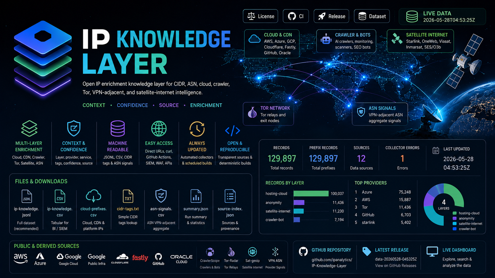

# IP Knowledge Layer

Open IP enrichment knowledge layer for CIDR, ASN, cloud, crawler, Tor, and
VPN-adjacent network intelligence.
It also includes satellite-internet prefix intelligence derived from public
operator GeoIP feeds, subnet-to-PoP mappings, BGP evidence, and ownership
signals.

<p align="center">
  
</p>

This repository is data-first: the main output is a set of machine-readable files
that can be pulled directly with `curl`, GitHub Actions, SIEM pipelines, WAF
tooling, anti-fraud systems, and internal enrichment jobs.


## Why This Exists

Most public IP repositories publish one narrow list: cloud IPs, Tor IPs, crawler
IPs, or ASN mappings. IP Knowledge Layer combines multiple public and derived
signals into one normalized enrichment layer.

The value is context:

```text
CIDR or ASN -> layer -> provider -> service -> tags -> confidence -> source
```

Instead of only knowing that a prefix exists, consumers can understand whether it
belongs to cloud hosting, CDN edge, GitHub infrastructure, AI crawlers, Tor, or a
satellite internet provider, or a VPN-adjacent ASN signal.

## Current Release

<!-- IPKL_SUMMARY_START -->
| Metric | Value |
|---|---:|
| Updated | `2026-08-25T13:30:30Z` |
| Release | [data-20260825-133030Z](https://github.com/ipanalytics/IP-Knowledge-Layer/releases/tag/data-20260825-133030Z) |
| Records | 138,012 |
| Prefix records | 138,012 |
| ASN signals | 0 |
| Sources | 12 |
| Collector errors | 1 |

| Layer | Records |
|---|---:|
| `hosting-cloud` | 104,025 |
| `satellite-internet` | 14,730 |
| `anonymity` | 11,796 |
| `crawler-bot` | 7,461 |

| Top Provider | Records |
|---|---:|
| Azure | 77,416 |
| AWS | 16,830 |
| Tor | 11,796 |
| GitHub | 7,428 |
| starlink | 6,328 |
<!-- IPKL_SUMMARY_END -->

## Download URLs

Replace `main` with another branch if needed.

```bash
BASE="https://raw.githubusercontent.com/ipanalytics/IP-Knowledge-Layer/main/data/current"

curl -fsSL "$BASE/summary.json"
curl -fsSL "$BASE/source-index.json"
curl -fsSL "$BASE/ip-knowledge.jsonl"
curl -fsSL "$BASE/ip-knowledge.csv"
curl -fsSL "$BASE/cloud-prefixes.csv"
curl -fsSL "$BASE/asn-signals.csv"
curl -fsSL "$BASE/cidr-tags.txt"
```

## Which File Should I Use?

| Need | Use this file | Why |
|---|---|---|
| I want the full knowledge layer | `ip-knowledge.jsonl` | Best for pipelines, `jq`, streaming, and preserving nested fields |
| I want Excel/BI/SIEM-friendly data | `ip-knowledge.csv` | Same broad dataset in tabular form |
| I only need cloud/CDN/developer platform ranges | `cloud-prefixes.csv` | Smaller and focused on AWS, Azure, GCP, Cloudflare, Fastly, GitHub, Oracle |
| I need quick CIDR-to-tags lookup | `cidr-tags.txt` | Lightweight text file: one CIDR plus comma-separated tags per line |
| I care about VPN-heavy/provider ASN signals | `asn-signals.csv` | ASN-level aggregate evidence, without raw VPN IP publication |
| I need to check source health and counts | `summary.json` | Current run status, layer counts, provider/source aggregates |
| I need source provenance | `source-index.json` | Source URLs, source types, and record counts |

For most users:

```text
Start with cloud-prefixes.csv if you only need cloud/datacenter/CDN ranges.
Start with ip-knowledge.jsonl if you want the full enrichment layer.
Start with cidr-tags.txt if you want the simplest possible feed.
```

## Files

| File | Purpose | Approx size |
|---|---:|---:|
| `data/current/summary.json` | Current build summary, counts, layer/provider/source aggregates | 8 KB |
| `data/current/source-index.json` | Source metadata, URLs, source types, record counts | 3 KB |
| `data/current/ip-knowledge.jsonl` | Full normalized knowledge layer, one JSON record per line | 49 MB |
| `data/current/ip-knowledge.csv` | Full normalized knowledge layer as CSV | 25 MB |
| `data/current/cloud-prefixes.csv` | Official cloud/CDN/developer-platform prefixes only | 22 MB |
| `data/current/asn-signals.csv` | ASN-level VPN-adjacent aggregate signals | 399 KB |
| `data/current/cidr-tags.txt` | Simple `CIDR tags` text file for lightweight consumers | 4.7 MB |
| `data/history/summary.csv` | Build history | small |
| `data/snapshots/*.json` | Compact summary snapshots, not full data copies | small |

## Layers

### `hosting-cloud`

Official cloud, CDN, edge, and developer-platform IP ranges.

Current providers:

- AWS
- Azure
- Google Cloud
- Google public infrastructure
- Cloudflare
- Fastly
- GitHub
- Oracle Cloud

### `crawler-bot`

Crawler, AI bot, monitoring probe, scanner, SEO bot, and social preview ranges
derived from [CrawlerScope](https://github.com/ipanalytics/CrawlerScope).

### `anonymity`

Tor relay host routes derived from [Tor-Radar](https://github.com/ipanalytics/Tor-Radar).

### `satellite-internet`

Satellite internet and satellite service provider prefixes derived from
[Sat-geoip](https://github.com/ipanalytics/Sat-geoip). Records preserve operator,
orbit class, BGP state, GeoIP semantics, PoP assignment, and confidence evidence
in JSONL `metrics`.

### `asn-signal`

ASN-level VPN-adjacent aggregate signals from provider analysis. This layer does
not publish raw VPN IP lists. It only publishes aggregate provider-to-ASN evidence.

## Source Inventory

Official/public sources:

- AWS IP ranges: `https://ip-ranges.amazonaws.com/ip-ranges.json`
- Azure Service Tags: `https://www.microsoft.com/en-us/download/details.aspx?id=56519`
- Google Cloud ranges: `https://www.gstatic.com/ipranges/cloud.json`
- Google public ranges: `https://www.gstatic.com/ipranges/goog.json`
- Cloudflare ranges: `https://www.cloudflare.com/ips-v4`, `https://www.cloudflare.com/ips-v6`
- Fastly public IP list: `https://api.fastly.com/public-ip-list`
- GitHub Meta API: `https://api.github.com/meta`
- Oracle Cloud ranges: `https://docs.oracle.com/en-us/iaas/tools/public_ip_ranges.json`

Derived project sources:

- CrawlerScope: crawler, AI bot, monitoring, scanner, and SEO bot ranges
- Tor-Radar: Tor relay and exit IPs
- Sat-geoip: satellite internet prefixes, operator attribution, BGP/PoP/GeoIP evidence
- VPN provider ASN summary: aggregate ASN signals, no raw VPN IP feed

## Record Shape

Example `hosting-cloud` JSONL record:

```json
{"prefix":"104.16.0.0/13","layer":"hosting-cloud","provider":"Cloudflare","service":"edge","tags":["cdn","edge","proxy"],"confidence":0.99,"source_id":"cloudflare-v4"}
```

Example `crawler-bot` JSONL record:

```json
{"prefix":"66.249.64.0/19","layer":"crawler-bot","provider":"Google","service":"Google common crawlers","tags":["bot","crawler","search"],"confidence":0.95,"source_id":"crawler-scope"}
```

Example `anonymity` JSONL record:

```json
{"prefix":"185.220.101.1/32","layer":"anonymity","provider":"Tor","service":"exit","tags":["anonymity-network","tor","tor-exit"],"confidence":0.98,"source_id":"tor-radar"}
```

Example `satellite-internet` JSONL record:

```json
{"prefix":"143.105.187.0/24","layer":"satellite-internet","provider":"starlink","service":"satellite_internet","tags":["satellite","satellite-internet","leo","bgp_announced"],"confidence":0.985,"source_id":"sat-geoip"}
```

Example `asn-signal` JSONL record:

```json
{"layer":"asn-signal","provider":"NordVPN","asn":9009,"asn_name":"M247","tags":["asn-signal","vpn-adjacent"],"confidence":0.7}
```

## Usage Examples

Get current build stats:

```bash
curl -fsSL https://raw.githubusercontent.com/ipanalytics/IP-Knowledge-Layer/main/data/current/summary.json | jq .
```

Download cloud prefixes:

```bash
curl -fsSLO https://raw.githubusercontent.com/ipanalytics/IP-Knowledge-Layer/main/data/current/cloud-prefixes.csv
```

Extract Cloudflare rows:

```bash
curl -fsSL https://raw.githubusercontent.com/ipanalytics/IP-Knowledge-Layer/main/data/current/cloud-prefixes.csv \
  | awk -F, '$3 == "Cloudflare" { print }'
```

Extract Tor exits from JSONL:

```bash
curl -fsSL https://raw.githubusercontent.com/ipanalytics/IP-Knowledge-Layer/main/data/current/ip-knowledge.jsonl \
  | jq -r 'select(.layer=="anonymity" and .service=="exit") | .prefix'
```

Extract AI crawler prefixes:

```bash
curl -fsSL https://raw.githubusercontent.com/ipanalytics/IP-Knowledge-Layer/main/data/current/ip-knowledge.jsonl \
  | jq -r 'select(.layer=="crawler-bot" and (.tags | index("ai-crawler"))) | .prefix'
```

Use as a lightweight block/allow enrichment feed:

```bash
curl -fsSL https://raw.githubusercontent.com/ipanalytics/IP-Knowledge-Layer/main/data/current/cidr-tags.txt \
  | grep 'cloud'
```

Find all ASN signals for a provider:

```bash
curl -fsSL https://raw.githubusercontent.com/ipanalytics/IP-Knowledge-Layer/main/data/current/asn-signals.csv \
  | awk -F, '$3 == "NordVPN" { print }'
```

## What It Can Help With

- IP enrichment for fraud/risk systems
- WAF and SIEM context
- Cloud/datacenter detection
- CDN/edge infrastructure classification
- AI crawler and bot visibility
- Tor relay context
- ASN-level VPN-adjacent signals
- Source provenance for explainable decisions
- Building internal allowlists, denylists, and review queues

This project is not a malware or abuse blacklist. It provides operational
network context with source provenance and confidence.

## Local Update

```bash
python3 scripts/update.py
```

The collector prefers local sibling project outputs when present:

```text
../crawler-scope/data/current/crawlers.json
../tor-radar/data/current/network.json
../release/analysis/data/provider_asn.csv
```

When those files are not present, it pulls the public raw GitHub project outputs
where possible.

## GitHub Actions

The workflow runs every 6 hours and commits updated files under `data/`.

```text
.github/workflows/ip-knowledge-layer.yml
```

The workflow intentionally stores full data only in `data/current/*`. Historical
snapshots are compact summaries to avoid repository bloat.

## Planned Improvements

Planned additions inspired by projects such as `ipverse`:

- `asn-knowledge.csv`: ASN-level rollup with tags, cloud presence, Tor presence,
  crawler presence, VPN-adjacent evidence, and confidence.
- `asn-prefixes.csv.gz`: compressed bulk ASN-to-prefix layer, kept separate from
  `ip-knowledge.jsonl` to avoid making the main file too large.
- `provider-index.json`: normalized provider metadata and aliases.
- `overlap-summary.csv`: overlap between cloud/CDN, crawler, Tor, and
  VPN-adjacent ASN signals.
- `diff/current.json`: added/removed prefix summary between runs.

The intent is not to clone `ipverse`. The goal is to build a higher-level
knowledge layer with source provenance, tags, and confidence.

## Notes

- The project avoids full IPv4 expansion.
- The project avoids mass RDAP/whois lookups in GitHub Actions.
- `vpn-adjacent` signals are aggregate ASN-level indicators, not a raw VPN IP
  dump.
- Confidence is source-level confidence, not a claim that traffic from a network
  is malicious.
- Some official providers publish overlapping service rows for the same prefix.
  Those rows are preserved because service labels carry useful context.

## License

CC0-1.0. See `LICENSE`.
